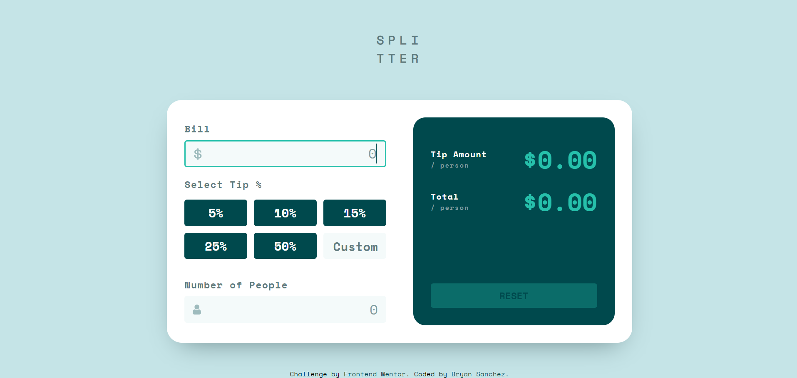

# Frontend Mentor - Tip calculator app solution

This is a solution to the [Tip calculator app challenge on Frontend Mentor](https://www.frontendmentor.io/challenges/tip-calculator-app-ugJNGbJUX). Frontend Mentor challenges help you improve your coding skills by building realistic projects.

## Table of contents

- [Frontend Mentor - Tip calculator app solution](#frontend-mentor---tip-calculator-app-solution)
  - [Table of contents](#table-of-contents)
  - [Overview](#overview)
    - [The challenge](#the-challenge)
    - [Screenshot](#screenshot)
    - [Links](#links)
  - [My process](#my-process)
    - [Built with](#built-with)
    - [What I learned](#what-i-learned)
    - [Continued development](#continued-development)
    - [Useful resources](#useful-resources)
  - [Author](#author)

## Overview

### The challenge

Users should be able to:

- View the optimal layout for the app depending on their device's screen size
- See hover states for all interactive elements on the page
- Calculate the correct tip and total cost of the bill per person

### Screenshot

### Links

- Solution URL: [Github](https://github.com/Bry-cmd/tip-calculator-app-main)
- Live Site URL: [Heroku](https://tip-calculator-app-bp.herokuapp.com/)

## My process

### Built with

- Semantic HTML5 markup
- CSS custom properties
- Flexbox
- CSS Grid
- [React](https://reactjs.org/) - JS library

### What I learned

The biggest thing I learned this challenge was how to use React JS, a tool that I've been wanting to use to improve my front-end web dev skills. To learn it, I followed along with a YouTube tutorial by Traversy Media (Link is in the useful resources section). I also learned how to organize my files in a react app, since I had to find a way to include the assets provided by the challenge somehow. Thankfully, the assets can be easily inserted by placing all their folders in the `src` folder. Finally, I decided to use Heroku to deploy the app since I've also been wanting to use that tool as well. The resources I used to learn how to do so is placed in the useful resources section!

### Continued development

- More React projects (familiarize myself w/ process and good practices of creating apps)
- Eventually learn backend stuff (start with simple JSON Server backend since it can be integrated right into React)

### Useful resources

- [React Official Site](https://reactjs.org/) - The official docummentation of React has been an extremely useful site for getting my React project up and running.
- [CSS Tricks](https://css-tricks.com/) - This is a great website that has saved me a lot of times whenever I get confused on how to use flexbox and grid.
- [StackOverflow](https://stackoverflow.com/) - This is a great site that has answers to almost any question I can think of when it comes to programming.
- [YouTube - Traversy Media](https://www.youtube.com/watch?v=w7ejDZ8SWv8&t=4911s) - An amazing crash course in React JS that helped me get familiar with the workflow in React
- [DEV Community](https://dev.to/chrisachard/tips-for-organizing-react-projects-191) - A great article that helped me figure out how to organize my files for a React app.
- [YouTube - Ashok Choudhary](https://www.youtube.com/watch?v=dn4mmfbletg) - A short video that explained a really simple way to upload my React app to Heroku.

## Author

- GitHub - [Bry-cmd](https://github.com/Bry-cmd)
- Frontend Mentor - [@Bry-cmd](https://www.frontendmentor.io/profile/Bry-cmd)